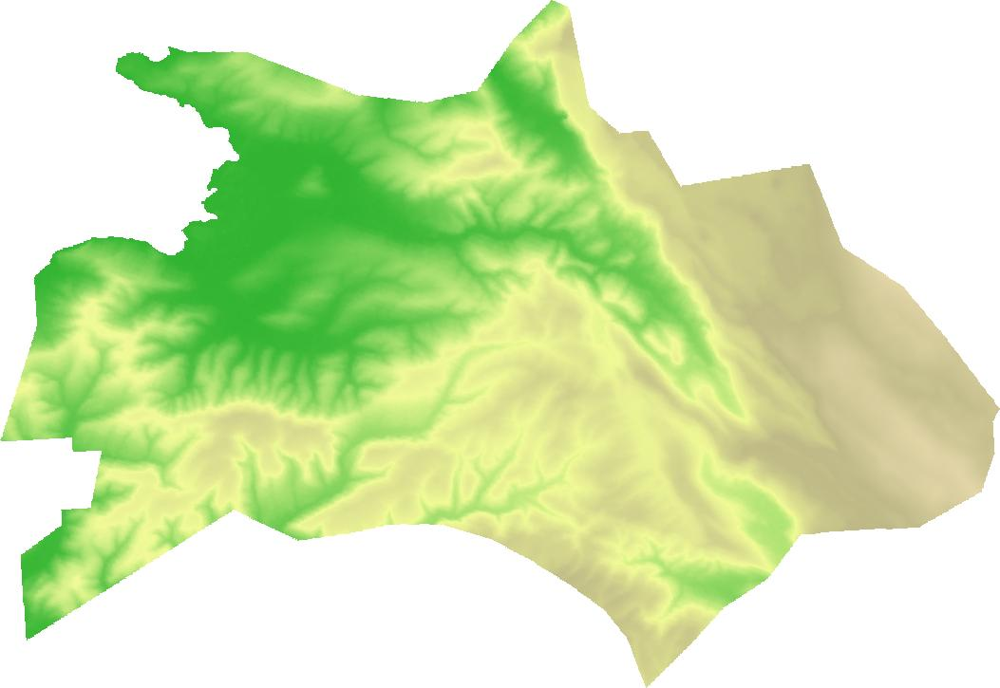

# Assignment 2: GDAL

In this assignment you will use **GDAL to process geodata in the command line**. To solve the exercise refer to the [GDAL documentation](https://gdal.org/). For a **short introduction into GDAL** watch this [video](https://www.youtube.com/watch?v=gkdNvwmoV_E&t=270s).

This assignment should be **done and submitted in pairs of 2 students.** Not the same ones as for assignment 1.

**Submission deadline:** Friday, Nov 12 2020, 23:55 via MS Teams  
**Documents to submit:** Zip compressed folder containing
 
- documentation.md
- color\_relief.bat (windows) or color_relief.sh (linux/mac)
- 3 color relief images of districts (.jpg)

The **file name should include your last names** e.g. mueller_schmidt.zip.

If you have **questions or problems** create a **new issue on GitHub**: [https://github.com/fossgis2122/fossgis_assignment2/issues](https://github.com/fossgis2122/fossgis_assignment2/issues)

## 0. Preparation

1. Fork and clone the repository to your computer. 
2. Download the data for this assignment from [here](https://heibox.uni-heidelberg.de/d/b5c96c0d5437461393ae/?dl=1). It contains the following files:

	* **gadm36\_SVN.gpkg:** [GADM](https://gadm.org/data.html) Administrative areas of Slovenia 
	* **N45E014.hgt:** Digital elevation model covering parts of Slovenia 
	* **n45\_e013\_1arc\_v3.tif:** Digital elevation model covering parts of Slovenia

## 1. Explore metadata of the files  [5pt]

Use the commands `gdalinfo` and `ogrinfo` to answer the following questions about all three files, e.g.

1. What is the coordinate reference system (EPSG) of each file? 
2. What is the driver (file format) of each file?
3. What is the spatial resolution of the raster files? (Don't forget to provide the units)
4. How many bands (for raster files) or layers (for vector files) does each file contain? 

Write the **answers to the questions along with the commands you've used**  in a new markdown file called **documentation.md**. You may want to use a markdown editor for this. (e.g. [typora](https://typora.io/))

**After you are done, track your changes:** Create a commit containing the new file **documentation.md** file and push it to GitHub.


## 2. Merge the DEM files [5pt]

1. Merge the two dem files **N45E014.hgt** and **n45\_e013\_1arc\_v3.tif** using the command `gdal_merge`. The output file should contain **only 1 band** and should be called **dem\_merge.tif**. 

2. Merge the tow dem files **N45E014.hgt** and **n45\_e013\_1arc\_v3.tif**  using the command `gdalbuildvrt`. The output file should contain **only 1 band** and should be called **dem\_buildvrt.vrt**. 

3. **Answer the following questions** based on the results and the GDAL documentation in the **documentation.md** file: 

	* What is the difference between the two output files? What is the reason for this? 
	* What might be an advantage of using `gdalbuildvrt` instead of `gdalmerge`?
 
 
**After you are done, track your changes:** Create a commit containing the changes in the **documentation.md** file and push it to GitHub.

## 3. Write a script to create color relief image [8pt]  

In this exercise you will write a script which creates a color relief image for a selected district of Slovenia. 

<p align="center">
	
	<br>
	Fig. 1: Color relief of the disctict 'Koper' in Slovenia
</p>

#### 1. Creat batch/shell script 

Create a file called **color_relief.bat on Windows** or **color_relief.sh on Linux/Mac**. This file will contain all commands needed for the creation of the color relief image. 

**Note for Mac OS/Linux:** The first line of the shell script should be `#!/bin/sh`.

#### 2. Extract the target district 
Select the Slovenian district with the name **Koper** from the **gadm36\_SVN.gpkg** file and save it to a new file called **koper.shp** using the `ogr2ogr` tool. Add the command in a new line to your script. 

**Hint:** Take a look at the examples given in the [ogr2ogr documentation](https://gdal.org/programs/ogr2ogr.html). 

#### 3. Clip and reproject the DEM to the district

**Clip** the dem file **dem_merge.tif** (from the previous exercise) to the selected district in **koper.shp** and **reproject** it to the coordinate reference system **EPSG:32632**. Save the result to a new file **koper_dem.tif** Add the command in a new line your script.

**Hint:** You could do both in one command using `gdalwarp`.

#### 4. Create a color relief image 

Create a color relief image based on the **koper_dem.tif** file using GDAL. Add the command in a new line to your script. Use the **[color_text.txt](./color_text.txt)** file for the `color_text_file` parameter. The output file should be called **koper\_color\_relief.jpg**.

#### 5. Add comments

Add comments to your script explaining what each command does. On Windows lines starting with `::` are interpreted as comments and are not executed. On Linux/Mac use `#` instead of `::`. Here is an example for Windows:

```
:: Create a directory named 'maps'
mkdir maps
```


#### 5. Create a commit and push it to github

Create a **commit containing your script and the final color relief image** and push it to GitHub. Continue doing this if you make further changes to these files. 

## 4. Apply the script to a different district [2pt]

Great, now you have a script which performs your analysis automatically. Now we want to apply the analysis to a different district, e.g. `Izola`. 

1. Replace all instances of the district name **'Koper'** in your script with **'Izola'**. Save the script and run it by executing the command 

	```
	$ ./color_relief.bat
	```
	
	**On Linux/Mac** you need to make the file executable first before running it:
	
	```
	$ chmod +x color_relief.bat.sh
	$ ./color_relief.sh
	```
	
	**Note:** The first line only needs to be exectuded once. 
	
	Now you should get a color relief image of the Izola district. 

2. Create a **commit containing the adapted script and the color relief of Izola** and push it to GitHub. 

3. Create a color relief image for another district of your choosing and push it to GitHub.

#### References

- [GDAL documentation](https://gdal.org/)  
- [GDAL Tutorial #1: Introduction + Installation](https://www.youtube.com/watch?v=gkdNvwmoV_E&t=270s)
- [GDAL Tutorial: Full playlist](https://www.youtube.com/watch?v=gkdNvwmoV_E&list=PL4aUQR9L9RFp2OOF3v9V_VEcXFmyLPz7f)