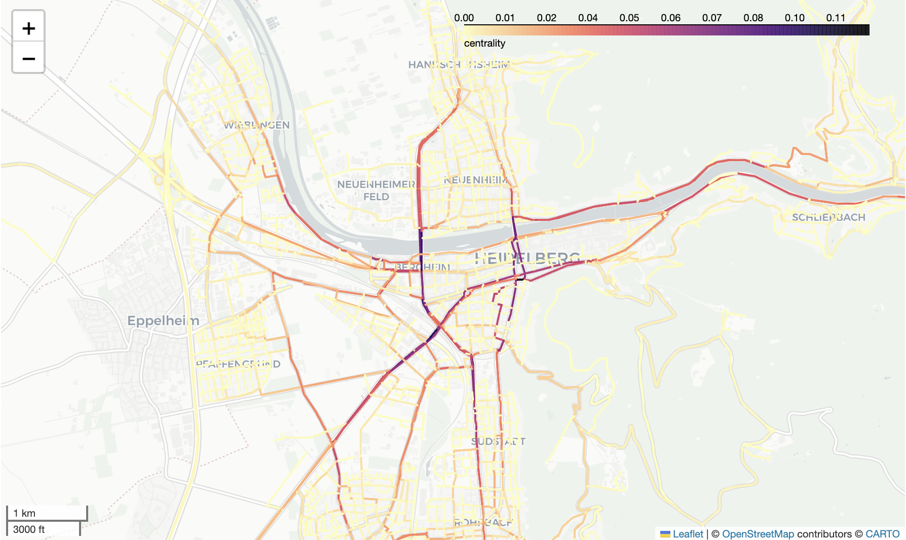

# Final project: 

## Organisational guidelines

- Groups of 2 students is recommended. If you want to work on it on your own, be aware that the workload could/will be higher than the ECTS of the course.  
- Both students need to contribute equally to the code development, e.g. visible in commit history. 
- Estimated time working on it: ca. 80 hours. The bonus question is optional, gives extra points. 
- Deadline: Ocotber 2023
- Submission: Fork the repository, add your code there and create a pull request.


## Introduction: Geographically Informed Betweenness Centrality

Betweenness centrality is an indicator to identify important nodes or edges in graph networks. Originally it was developed for social networks (e.g. facebook). Applied to road networks this can be used to model traffic speed or identify critical roads to support disaster preparedness. Still, open challenges remain on how the geographical context of road networks (e.g. road type, spatio-temporal travel patterns) should be integrated and how to efficiently calculate centrality indicators for such complex networks.



### How is betweenness centrality calculated?

#### Original betweenness centrality (e.g. for social networks)

1. Calculate the shortest routes between all nodes in the network graph. 
2. Count how many times each edge is containted in the routes.  

#### Adapting betweenness centrality to geographical space 

- Calculate the fastest route instead of the shortest. 
- Calculate only a sample of routes and choose the start and end points of the routes based on population distribution.

### Calculating betweenness centrality using Python

There are different Python packages for network analysis which include functions to calculate betwenness centrality, e.g.  
- 
- osmnx: Create graph network based on OSM data 
- NetworkX: Calculate centrality 
- NetworKit: Calculate centrality

Take a look at the [jupyter notebook ./src/betweenness_centrality.ipynb](./src/betweenness_centrality.ipynb) for a brief introduction. 

#### Installation 

Install the following packages in your python environment. 

```
conda install -c conda-forge osmnx networkx

```

## Project guidelines 

### Requirements

1. Work through the [jupyter notebook ./src/betweenness_centrality.ipynb](./src/betweenness_centrality.ipynb) to learn how to calculate (geographically adapted) betweenness centrality. 


Write a Python program which calculates betweenness centrality based on OpenStreetMap data for a selected study area **using different calculation methods.**

#### Program input 

The programm should be executable from the command line with optional input parameters
  - Study area, e.g. "Heidelberg, Germany"
  - Method to calculate centrality, e.g. networkx or geographical
  - Number of routes (for own geographical method)
  - Route type, e.g. shortest or fastest
  - Output folder 

#### Program output

The program should create a new folder in the output folder in which all output is stored. The name of the folder should contain the name of the study area, the calculation method and the route type. 

The following files should be created in the output folder: 

- GeoPackage containing the graph network including a column called 'centrality' which contains the calculated centrality index for each road segment.
- Image (jpg or png) showing the betweenness centrality of the study area

## Apply the best practices of scientific programming 

- [x] Use of functions and classes. Store them in a package and/or modules, not in your main script. 
- [x] Ensure good code style and comments. Use pre-commit. 
- [x] Write good documentation == good readme. Use a template for this. 
- [x] Provide an easy to execute example of your program in your readme.
- [x] Set up a clear folder and file structure (see below 'Project folder structure')   
- [x] Constantly create commits throughout the development process. Both students need to create commits!
- [x] Use vectorized functions if possible.
- [x] Write unit tests (minimum of 3 tests)
- [x] User friendly error handling, i.e. give the user meaningful error message so they can solve the problem themselves

### Project folder structure 

Your folder and files in your repository could be arranged in the following way:

```
- src
    - tests
        - test_mypackage.py
    - mypackage
        - mymodule1.py
        - mymodule2.py
    main.py
    betweenness_centrality.ipynb
- readme.md
- .pre-commit-config.yaml
- further files if necessary
```


## Research questions

Use the program you have written to generate different kinds of betweenness centrality indicators. Compare them with each other and answer the following questions in a new juputer notebook. 

- Write one short paragraph for each question along with one or two suitable figures. 
- No REPORT required! 
- Cite relevant literature if applicable. 

1. Calculate the betweenness centrality based on the shortest route and the one based on fastest route using the `networkx` package. Where are the biggest differences between them? Which one do you think is more realistic? Create figures to show your findings.
2. Calculate the geographically adapted betweenness centrality using your own implementation from the notebook several times with increasing number of routes. Compare the centrality index to the one calculated using the `ox.edge_betweenness_centrality` function from the networkx package. How does the difference between the two change with increasing number of routes? Create a figure to show this. 
3. **Bonus:** Implement a function to choose the start and end nodes for the routes using the population data. Calculate the betweenness centrality based on this implementation and compare it with the betweenness centrality based on random start and endpoints. How do the resulting betweenness centrality indices differ? 


