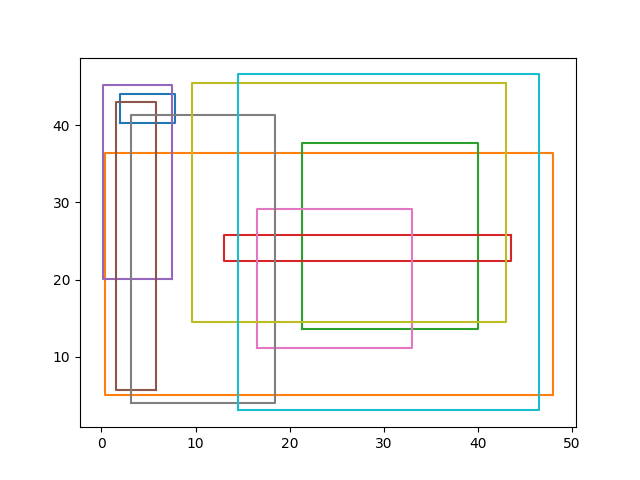

# Random Rectangles

This program creates random rectangles. Here is an example of 10 random rectangles.

<p align="center">

</p>

## Installation

The code requires Python >=3.9 and the package `pandas`.

For development purposes you need to install the packages

* pytest
* precommit
* black
* flake8

Using anaconda:

```
conda install -c conda-forge black pytest flake8 pre-commit
```

All requirements are also given in `pyproject.toml`.

## Usage

To create random rectangles, run `python main.py`.

## Contribution guidelines

### Run the tests

To make sure that the code works fine, [run the unit tests](./docs/testing.md) by executing

```
pytest test_rectangle.py
```

### Code style using pre-commit

The [package `pre-commit`](./docs/precommit.md) is used to ensure consistent code style. The rules are defined in `.pre-commit-config.yaml`.
Install the pre-commit hooks by executing

```
pre-commit install
```

### Create a new branch

Create a new branch with a unique name, e.g. with your first name

```
git checkout -b christina
```

You should push your commits only to this branch, not the main branch.

### Create a Merge Request

After you have solved one of the issues, create a merge request on GitLab.

## Contributors

* Christina Ludwig
* Niko (Kolaxidis)

## Resources

* Debugging in PyCharm:
* Refactoring in PyCharm:
