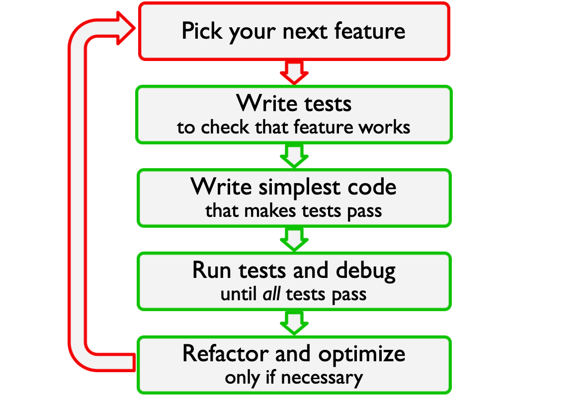

# Unit testing

A [unit test]() is a small test, which [checks that a single component of your code operates in the right way](). A unit test helps you to isolate what is broken in your application and fix it faster.

<!-- .element: class="fragment" data-fragment-index="1" -->

[(Real Python: Getting Started with testing)](https://realpython.com/python-testing/)
<!-- .element: class="fragment" data-fragment-index="1" -->


[comment]: # (!!! data-auto-animate)

## Testing frameworks in Python
* unittest
* nosetest
* **pytest** (We will use this one)

[comment]: # (!!! data-auto-animate)

### Basic structure of a test

#### Given:
Put your system in the right state for testing e.g. create test variables.

#### When:
Execute the feature that you are testing.

#### Then:
Define the expected result of the test and check that the actual outcome equals the expected result.

[comment]: # (!!!)

### Example using pytest

&#8594; The code for testing is contained in a function whose name starts with `test_xxx()`

``` python

def add(a, b):
	return a + b

def test_add():
	# Test variables
	a = 2
	b = 3
	expected_result = 5

	# Calculate area
	actual_result = add(a=a, b=b)

	# Check if calculated result equals expected result
	assert expected_result == actual_result
```

&#8594; All test functions are stored in a file called `test_xxx.py`, e.g. `test_geometry.py`

<!-- .element: class="fragment" data-fragment-index="3" -->

[comment]: # (!!! data-auto-animate)

### What a good test looks like

#### Good:<!-- .element: class="fragment" data-fragment-index="1" -->
* Short and quick to execute
* Easy to read
* Exercise one thing
* Fails fast

<!-- .element: class="fragment" data-fragment-index="1" -->

#### Bad:<!-- .element: class="fragment" data-fragment-index="2" -->
* Relies on data files
* Messes with “real-life” files, servers, databases

<!-- .element: class="fragment" data-fragment-index="2" -->

[comment]: # (!!! data-auto-animate)

#### Question:
What would you do if the user executes `Rectangle("4", "5")`?

a) Use `print()` to inform the user the arguments need to be numbers and return a new `Rectangle` object.

b) Use `print()` to inform the user the arguments need to be numbers and return `None`.

c) Raise an error.

d) Fix the arguments and return a new `Rectangle` object.


### Test-Driven Development


