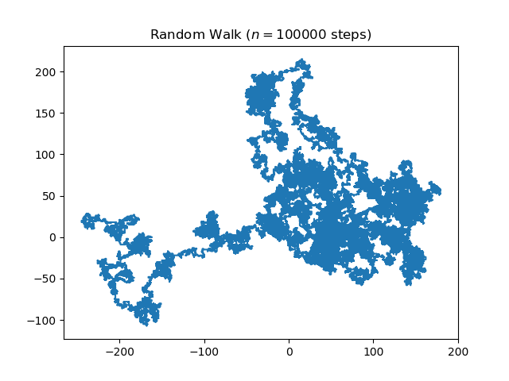

# Random Walk Simulation

This is a **group exercise**, so you should be working in pairs of two students. The goal is to **practise writing readable, maintainable, reliable, reusable and efficient code collaboratively.**

This assignment is part of your final grade. **Fulfilling the minimum requirements** (see below) **is required to pass this assignment**. Implementing some of the **additional requirements will give you extra points** (e.g to make up for deficits in your personal project).

## Organisation

1. **Set up your repository:** One student of your group forks the code from [https://courses.gistools.geog.uni-heidelberg.de/advancedgeoscripting2022/random-walker](https://courses.gistools.geog.uni-heidelberg.de/advancedgeoscripting2022/random-walker). This student invites the other student as a collaborator to the forked repository, so you can both work on the code.

2. **Work on the code** to fulfil the requirements (see below).

3. **Merge Request:** Once you're done, create a merge request into the main branch of the advancedgeoscripting2022/random-walker repo. **Deadline: Wed, 9:00 am.**

4. **Code review:** Each group reviews the code of another group on Wednesday.

5. **Improve your code** based on the review you got.

## Improve the Random Walker program

In this repo you find a basic implementation of a [random walk simulation](https://en.wikipedia.org/wiki/Random_walk) in 2-dimensional space taken from [this blogpost](https://www.geeksforgeeks.org/random-walk-implementation-python/). Running the code yields an image which shows the path of the random walk.

The program works but it is not very readable. **Apply the best practices in scientific computing** to make the code more readable, maintainable, reliable, reusable and efficient. In addition, **extend the program** based on the requirements listed below.

### Minimum requirements:

These **requirements are mandatory** to pass the assignment.

1. The program should be able to simulate **multiple random walkers**, not just one.
2. The program should be **executable from the command line**.
3. The user should be able to **specify the number of random walkers** through a command line parameter.
4. **Write tests** to see if you're random walkers are working as expected.
5. Make sure to use the best-practices by Wilson net al 2014 for **readable code style**.
6. **Document** how to install and run the program in your README.md, e.g. take a look at this [readme template](https://gist.github.com/DomPizzie/7a5ff55ffa9081f2de27c315f5018afc).

### Additional requirements:

These **requirements are optional.**

1. Create three different types of walkers, e.g. a "fast walker" which has a bigger step size.
2. Add a "landscape" in which the random walkers are walking in which contains obstacles which the walkers cannot cross (e.g. a lake)
3. Invent and implement another functionality of your own.

Be creative here! :)

## Code Review

Wednesday morning each group will review the code of another group. The reviewing group can leave comments in the code or create issues regarding:

1. Is the documentation in the README.md clear?
2. Does it work properly? Try to make it fail and report bugs.
3. Leave suggestions to improve the code. Are the best-practices implemented in the code? Take a look at Wilson et al. (2014) again.
4. Ask questions if you don't understand certain parts of the code.
5. Also give compliments for good solutions. :)
