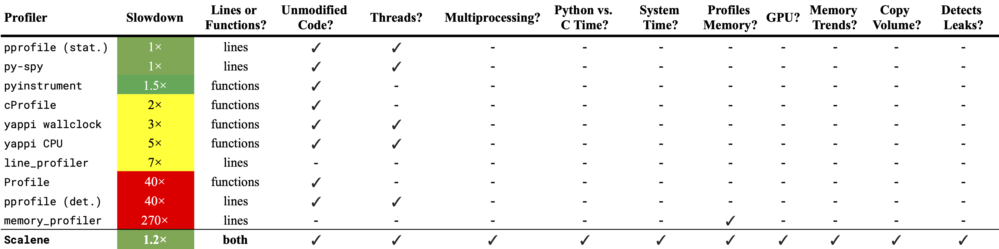

# Profiling

There are many Python packages for profiling CPU and memory usage

 
Figure 1: Comparison of Python profilers (Berger 2020)

## PyCharm Integration
- Based on cProfiler package
- Requires PyCharm Professional License (free for students and teachers)
- [Video: PyCharm Profiler Demo](https://www.youtube.com/watch?v=pMSv-jxuyMQ)

## Jupyter notebooks
- Use the `%%timeit` magic command to measure execution time of a cell 

## Scalene
- Scalene: a high-performance CPU, GPU and memory profiler for Python. 
- [GitHub: Scalene](https://github.com/plasma-umass/scalene)
- [Video: Scalene Demo](https://www.youtube.com/watch?v=5iEf-_7mM1k)

### Demo

Install scalene using pip

```
pip install scalene
```

Run profiling. 

```
scalene program.py
```

Get command line output
```
scalene --cli program.py
```

## References
Berger, E. D. (2020). Scalene: Scripting-language aware profiling for python. arXiv preprint arXiv:2006.03879.
